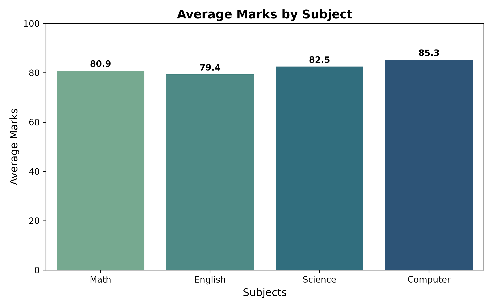
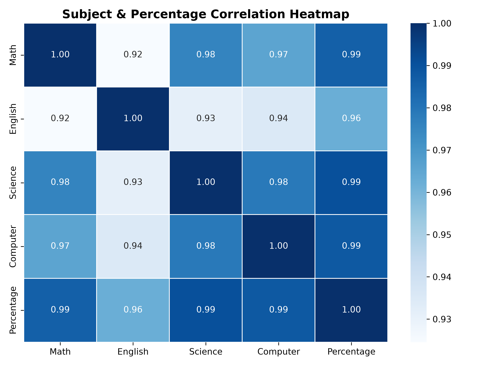
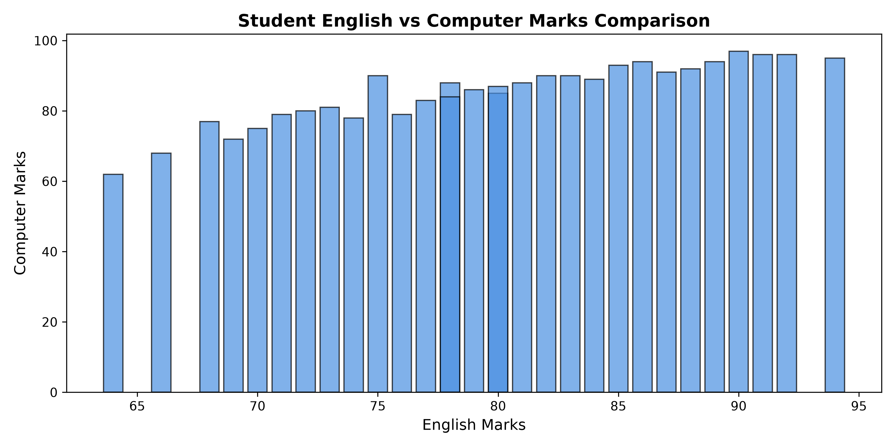
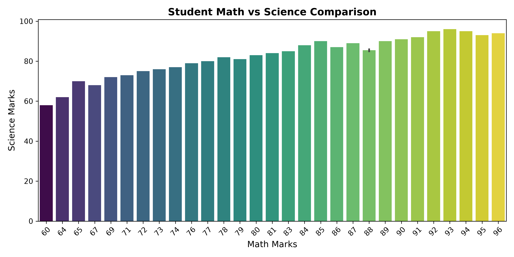

# 📊 Student Performance Analyzer

<div align="center">

[](https://www.python.org/)
[](https://pandas.pydata.org/)
[](https://numpy.org/)
[](https://matplotlib.org/)
[](https://seaborn.pydata.org/)
[](https://jupyter.org/)
[](LICENSE)
[](https://github.com/ahsanadeem840-ai/Student-Performance-Analyzer/stargazers)

<p align="center">
  <b>A complete Exploratory Data Analysis (EDA) pipeline and statistical evaluation toolkit designed to compute, aggregate, and visualize student academic achievement across core subjects.</b>
</p>

[Key Features](#-key-features) •
[Dataset](#-dataset-overview) •
[Visualizations](#-visualizations--insights) •
[Statistical Summary](#-statistical-findings) •
[Installation](#-getting-started) •
[Usage](#-usage) •
[Author](#-author)

</div>

---

## 📌 Project Overview

The **Student Performance Analyzer** is an automated academic analytics tool built with Python, Pandas, NumPy, Matplotlib, and Seaborn. It ingests student grade records across multiple disciplines—**Mathematics**, **English**, **Science**, and **Computer Science**—to calculate aggregate scores, evaluate percentage distributions, extract descriptive metrics, identify outliers, and render publication-ready visualizations.

Whether deployed locally or run inside a Google Colab notebook, the project serves as an end-to-end framework for evaluating classroom trends, pinpointing curriculum bottlenecks, and celebrating high achievers.

---

## ✨ Key Features

- **Automated Grade Computation**: Instantly calculates total marks (out of 400) and percentage scores for all students.
- **Descriptive Statistical Analysis**:
  - Global class average computation.
  - NumPy-powered maximum, minimum, mean, and standard deviation calculations.
- **High & Low Achiever Identification**:
  - Dynamically extracts top-performing and at-risk students using index-based condition querying (`idxmax()` / `idxmin()`).
- **Performance Filtering & Segmentation**:
  - Filters high-achieving students scoring above 80% with clear demographic breakdown.
- **Subject-by-Subject Benchmarking**:
  - Aggregates subject averages to evaluate cross-curriculum performance.
- **Exploratory Visualizations**:
  - Clean bar charts with data labels.
  - Heatmaps highlighting inter-subject score correlations.
- **Cross-Platform Compatibility**:
  - Works seamlessly in both local environments (CLI / IDEs) and cloud notebooks (Google Colab, Jupyter).

---

## 📁 Repository Structure

```text
Student-Performance-Analyzer/
├── assets/                                 # Exported high-resolution visualization charts
│   ├── average_marks_by_subject.png        # Subject comparison bar chart
│   ├── correlation_heatmap.png             # Correlation matrix heatmap
│   ├── math_vs_science.png                 # Math vs Science distribution chart
│   └── student_scores_bar.png              # English vs Computer comparison chart
├── Student_performance_analyzer.ipynb      # Google Colab / Jupyter interactive notebook
├── student_performance_analyzer.py         # Standalone Python script for local & cloud runs
├── students.csv                            # Student academic dataset (30 student records)
├── requirements.txt                        # Python dependencies
├── .gitignore                              # Git exclusion rules
├── LICENSE                                 # MIT Open Source License
└── README.md                               # Project documentation
```

---

## 📊 Dataset Overview

The dataset (`students.csv`) contains 30 student entries across 5 key attributes:

| Column | Type | Description |
| :--- | :--- | :--- |
| `Student` | String | Student Name |
| `Math` | Integer | Score in Mathematics (0–100) |
| `English` | Integer | Score in English Language (0–100) |
| `Science` | Integer | Score in Natural Sciences (0–100) |
| `Computer` | Integer | Score in Computer Science (0–100) |

### Sample Data Preview:
| Student | Math | English | Science | Computer | Total | Percentage |
|:---|:---:|:---:|:---:|:---:|:---:|:---:|
| Ali | 85 | 78 | 90 | 88 | 341 | 85.25% |
| Ahmed | 65 | 72 | 70 | 80 | 287 | 71.75% |
| Sara | 92 | 89 | 95 | 94 | 370 | 92.50% |
| Fatima | 95 | 91 | 93 | 96 | 375 | 93.75% |
| Iqra | 93 | 94 | 96 | 95 | 378 | 94.50% |

---

## 📈 Visualizations & Insights

### 1. Average Marks by Subject
Displays the class-wide performance across the four academic disciplines.

<p align="center">
  
</p>

> **Insight:** **Computer Science** achieved the highest classroom average at **85.30**, followed by **Science** (**82.53**), **Math** (**80.90**), and **English** (**79.40**).

---

### 2. Subject Correlation Heatmap
Explores inter-subject performance correlations and alignment with total percentage.

<p align="center">
  
</p>

> **Insight:** Strong positive correlation (>0.85) across all subjects indicates consistent academic performance across technical and language curricula.

---

### 3. Student Scores Comparison (English vs Computer)
Demonstrates individual variations between language arts and computing science.

<p align="center">
  
</p>

---

### 4. Math vs Science Distribution
Highlights the correlation and comparative spread between quantitative and natural science tracks.

<p align="center">
  
</p>

---

## 📋 Statistical Findings

Key findings derived from the 30-student cohort:

| Metric | Result | Details |
| :--- | :--- | :--- |
| **Class Average Percentage** | `82.03%` | Healthy overall classroom mastery |
| **Top Performing Student** | `Iqra` | Score: **378 / 400** (**94.50%**) |
| **Lowest Performing Student** | `Bilal` | Score: **244 / 400** (**61.00%**) |
| **Percentage Spread (Min - Max)** | `61.00% - 94.50%` | Range of 33.5 percentage points |
| **Standard Deviation** | `± 8.93%` | Moderate variance around the mean |
| **High Achievers (>80%)** | `18 students` | **60.0%** of the entire class |

---

## 🚀 Getting Started

### Prerequisites
Make sure you have **Python 3.8+** installed on your system.

### 1. Clone the Repository
```bash
git clone https://github.com/ahsanadeem840-ai/Student-Performance-Analyzer.git
cd Student-Performance-Analyzer
```

### 2. Create and Activate a Virtual Environment
```bash
# Windows
python -m venv venv
venv\Scripts\activate

# macOS / Linux
python3 -m venv venv
source venv/bin/activate
```

### 3. Install Dependencies
```bash
pip install -r requirements.txt
```

---

## 💻 Usage

### Run via Command Line
Execute the main script to process the dataset, print summary statistics to the terminal, and save visualization figures to the `assets/` folder:
```bash
python student_performance_analyzer.py
```

### Run via Jupyter Notebook
Launch Jupyter Notebook to inspect the interactive analysis:
```bash
jupyter notebook Student_performance_analyzer.ipynb
```

### Run on Google Colab
1. Upload `Student_performance_analyzer.ipynb` to [Google Colab](https://colab.research.google.com/).
2. Run each cell sequentially.
3. When prompted, upload `students.csv`.

---

## 🛠️ Built With

- **[Python](https://www.python.org/)** - Core programming language
- **[Pandas](https://pandas.pydata.org/)** - Data manipulation, filtering, and aggregation
- **[NumPy](https://numpy.org/)** - Numerical operations and array-level statistics
- **[Matplotlib](https://matplotlib.org/)** - Base charting and plot aesthetics
- **[Seaborn](https://seaborn.pydata.org/)** - Statistical visual representations and color palettes

---

## 🤝 Contributing

Contributions, issues, and feature requests are welcome!
Feel free to check the [issues page](https://github.com/ahsanadeem840-ai/Student-Performance-Analyzer/issues).

1. Fork the Project
2. Create your Feature Branch (`git checkout -b feature/AmazingFeature`)
3. Commit your Changes (`git commit -m 'Add some AmazingFeature'`)
4. Push to the Branch (`git push origin feature/AmazingFeature`)
5. Open a Pull Request

---

## 📜 License

Distributed under the MIT License. See [`LICENSE`](LICENSE) for more information.

---

## 👤 Author

**Muhammad Ahsan**
- GitHub: [@ahsanadeem840-ai](https://github.com/ahsanadeem840-ai)
- Email: [ahsanadeem840@gmail.com](mailto:ahsanadeem840@gmail.com)

⭐ *If you find this project useful, please consider giving it a star on GitHub!*
